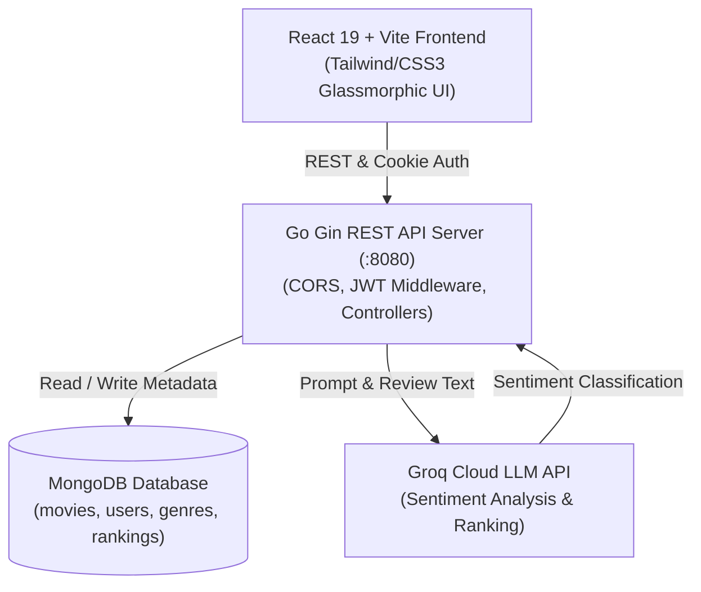

# MagicStream — Next-Gen AI Movie Streaming Platform

<div align="center">

### *Spatial UI • AI Sentiment Review Analysis • High-Performance Go Backend*

**Made with ❤️ by [Himanshu Singh Yadav](https://github.com/Himanshusinghyadavup61)**

[](https://react.dev/)
[](https://vitejs.dev/)
[](https://golang.org/)
[](https://gin-gonic.com/)
[](https://www.mongodb.com/)
[](https://groq.com/)

[Explore Catalog](#key-features) • [Quick Start](#getting-started) • [API Reference](#api-endpoints) • [Seed Accounts](#pre-seeded-demo-accounts)

</div>

---

## Overview

**MagicStream** is a modern full-stack movie streaming, discovery, and community review SaaS application. Built with high-performance Go micro-services, reactive frontend components, and cutting-edge spatial UI design, MagicStream empowers users to explore movie catalogs, watch trailers in theater mode, and receive automated AI sentiment rankings on critical reviews.

---

## Key Features

### Groq LLM Review Intelligence
- Automated critic review classification powered by **Groq** (`openai/gpt-oss-120b`).
- Extracts review nuances and automatically computes sentiment rankings:
  `Terrible` • `Bad` • `Okay` • `Good` • `Excellent`.

### Personalized Recommendation Engine
- Tailored recommendation algorithm matching user-preferred genres against catalog titles.
- High-priority discovery feed customized for authenticated profiles.

### Cinema Theater Mode
- Dedicated distraction-free cinema player utilizing responsive 16:9 framing, YouTube player streams, and dynamic ambient background lighting.

### Secure Authentication & Role-Based Access Control (RBAC)
- JWT authentication with secure HTTP-only access and refresh cookies.
- Distinction between standard **USER** accounts and editorial **ADMIN** workstations.

---

## Architecture



---

## Tech Stack

| Domain | Technology | Description |
| :--- | :--- | :--- |
| **Frontend** | **React 19**, **Vite 6** | High-performance SPA with modern React hooks & router |
| **Styling** | **Custom CSS3 / Glassmorphism** | Spatial depth, CSS 3D transforms, custom scrollbars |
| **Icons & Media** | **FontAwesome Solid**, **ReactPlayer** | Scalable vector icons & unified media player |
| **Backend** | **Go (Golang 1.24)** | High-throughput, concurrent API services |
| **Web Framework**| **Gin-Gonic** | Fast HTTP web framework with middleware support |
| **Database** | **MongoDB (v8.0)** | Document storage for catalog metadata & user profiles |
| **AI / LLM** | **Groq Cloud API** | Ultra-low latency LLM inference via LangChainGo |

---

## Getting Started

### 1. Prerequisites
- **Node.js** (v18+) & **npm**
- **Go** (v1.23+)
- **MongoDB** running locally on port `27017`

---

### 2. Database Initialization & Seeding

Ensure MongoDB is active:
```powershell
# Windows
Get-Service -Name '*mongo*'
```

Seed the initial users and catalog into the `magicstream` database:
```bash
# Seed user accounts
& "C:\Program Files\MongoDB\Server\8.0\bin\mongosh.exe" magicstream magic-stream-seed-data/seed_users.js
```

---

### 3. Backend Setup

1. Navigate to the server folder:
   ```bash
   cd Server/MagicStreamServer
   ```
2. Verify or create your `.env` file:
   ```env
   PORT=8080
   MONGODB_URI=mongodb://localhost:27017
   DATABASE_NAME=magicstream
   SECRET_KEY=MagicStreamSuperSecretJWTKey2025
   SECRET_REFRESH_KEY=MagicStreamSuperSecretRefreshJWTKey2025
   ALLOWED_ORIGINS=http://localhost:5173,http://localhost:5174
   RECOMMENDED_MOVIE_LIMIT=5
   GROQ_API_KEY=your_groq_api_key_here
   GROQ_MODEL=openai/gpt-oss-120b
   BASE_PROMPT_TEMPLATE="You are an AI that reviews movie reviews and classifies the sentiment into one of the following categories: {rankings}. Only respond with one of the exact category names and nothing else. Review: "
   ```
3. Run the Go server:
   ```bash
   go run main.go
   ```
   *The server will start listening on `http://localhost:8080`.*

---

### 4. Frontend Setup

1. Open a new terminal and navigate to the client folder:
   ```bash
   cd Client/magic-stream-client
   ```
2. Install dependencies:
   ```bash
   npm install
   ```
3. Start the development server:
   ```bash
   npm run dev
   ```
4. Access the web app in your browser at `http://localhost:5173`.

---

## Pre-Seeded Demo Accounts

The database comes pre-seeded with sample user accounts for testing:

| Name | Email | Role | Favorite Genres | Password |
| :--- | :--- | :--- | :--- | :--- |
| **Himanshu Yadav** | `himanshu@gmail.com` | **ADMIN** | Comedy, Fantasy | `himanshu@123` |
| **Sarah Smith** | `sarahsmith@hotmail.com` | **USER** | Thriller, Sci-Fi, Mystery | `Password1!` |
| **Ben Madison** | `benmadison@hotmail.com` | **USER** | Comedy, Thriller, Sci-Fi | `Password1!` |

> [!NOTE]
> Log in as **Himanshu Yadav** (`himanshu@gmail.com` / `himanshu@123`) to access **ADMIN** capabilities, allowing you to edit and submit editorial reviews with live AI sentiment analysis.

---

## API Endpoints

### Public Endpoints
- `GET /hello` — Health check status.
- `GET /movies` — Retrieve all movies in the catalog.
- `GET /genres` — Retrieve available movie genres.
- `POST /register` — Register a new user account.
- `POST /login` — Authenticate user and issue JWT cookies.

### Protected Endpoints (Requires JWT Cookie)
- `GET /recommendedmovies` — Fetch personalized recommendations based on favorite genres.
- `GET /movie/:imdb_id` — Fetch details for a specific movie title.
- `PATCH /updatereview/:imdb_id` — (Admin Only) Submit an editorial review and trigger automated Groq AI sentiment classification.
- `POST /logout` — Invalidate user session and clear cookies.

---

## Project Structure

```text
MagicStream/
├── Client/
│   └── magic-stream-client/     # React 19 + Vite Frontend
│       ├── src/
│       │   ├── api/             # Axios instances & interceptors
│       │   ├── assets/          # Logos & visual branding
│       │   ├── components/      # UI components (Header, Home, Movies, Review, etc.)
│       │   ├── context/         # AuthContext & state providers
│       │   ├── hooks/           # useAuth, useAxiosPrivate
│       │   ├── App.css          # Layout, animations, and marquee footer styles
│       │   └── index.css        # Antigravity glassmorphism design system
├── Server/
│   └── MagicStreamServer/       # Go 1.24 Gin REST API Server
│       ├── controllers/         # Movie, user, and review handlers
│       ├── database/            # MongoDB connection manager
│       ├── middleware/          # JWT auth & route guards
│       ├── models/              # BSON/JSON schemas
│       ├── routes/              # Protected & unprotected route definitions
│       ├── utils/               # JWT token generation & cookie utilities
│       └── main.go              # Application entrypoint
├── magic-stream-seed-data/      # JSON seed files & database initialization scripts
└── README.md                    # Project documentation
```

---

## 👨‍💻 Author

**Himanshu Singh Yadav**
- GitHub: [@Himanshusinghyadavup61](https://github.com/Himanshusinghyadavup61)


